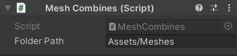
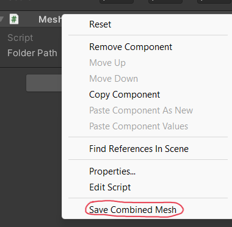

# CombineMesh

Данный компонент позволяет получить меш из любого Game Object, для дальнейшего использования в проекте.

## Как использовать 

Необходимо поместить компонент на объект, с которого нужно скопировать Mesh и указать путь  в поле Folder Path

Далее необходимо открыть меню компонента и выбрать кнопку Save Cobined Mesh. Если по указонному пути папка уже существует, то меши созранятся в неё. В противном случае будет создана новая папка. После  создания мешей, рекомендуется убрать компонент с объекта.

❗ Компонент работает только в Unity Editor

